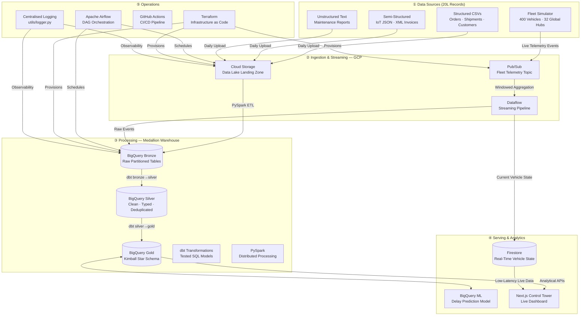

<div align="center">

# 🌐 Enterprise Supply Chain & Logistics Data Platform
### End-to-End Batch & Streaming Data Engineering on Google Cloud Platform

[](https://cloud.google.com)
[](https://cloud.google.com/bigquery)
[%20Records-blue)](#-data-scale--generation)
[](#-infrastructure-as-code)
[](#-supply-chain-control-tower-dashboard)
[](LICENSE)

*A comprehensive, enterprise-grade data engineering portfolio project solving real-world global logistics challenges on Google Cloud Platform — with 20 Lakh records, 6-continent fleet tracking, and a live Control Tower dashboard.*

</div>

---

## 📖 Project Overview & Business Problem

Global supply chain companies face immense challenges in tracking inventory, optimising delivery routes, and maintaining vehicle fleets across continents. When data is siloed across CRM systems, warehouse databases, and IoT devices on trucks spread across 6 continents, it becomes impossible to make real-time decisions.

**The Goal:** Build a centralized, highly scalable data platform on GCP that unifies historical batch data (orders, shipments, inventory) with real-time streaming data (IoT fleet telemetry) to power a live **Supply Chain Control Tower** and predict shipment delays before they happen.

### Key Business Outcomes

| Outcome | Description |
|---|---|
| 📉 **Predictive Logistics** | Identify shipments at risk of delay using BigQuery ML Logistic Regression |
| 🚚 **Real-Time Fleet Tracking** | Monitor 4,000+ vehicles globally — speed, fuel, engine health, per continent |
| 📦 **Warehouse Optimisation** | Track capacity across 200 global distribution centres via automated daily pipelines |
| 🌍 **Global Visibility** | Single pane of glass across North America, Europe, Asia Pacific, ME&A, South America |
| 💰 **Revenue Intelligence** | $485M+ order revenue tracked with on-time delivery rate analytics |

---

## 🏗️ Architecture & Data Pipeline

The pipeline implements the **Medallion Architecture** (Bronze → Silver → Gold) combining both Batch and Streaming paradigms across a fully cloud-native GCP stack.



### Pipeline Stages

| Stage | Technology | Description |
|---|---|---|
| **① Data Lake** | GCS | Raw files land in `bronze/`, `silver/`, `gold/` GCS buckets. PySpark handles deduplication and type coercion at scale. |
| **② Streaming** | Pub/Sub → Dataflow | Docker containers simulate 400 global trucks sending IoT telemetry every second. Dataflow windows events, writes raw logs to BigQuery Bronze, and updates Firestore for sub-100ms dashboard lookups. |
| **③ Warehouse** | BigQuery + dbt | Raw Bronze data is cast, cleaned, and partitioned into Silver. dbt transforms Silver into Kimball Star Schema Gold with SCD Type 2 for historical tracking (driver licence updates, vehicle status changes). |
| **④ ML** | BigQuery ML | Logistic Regression trained in-warehouse on `is_delayed` flag, exposed via BigQuery prediction queries. No separate ML infrastructure needed. |
| **⑤ Serving** | Next.js + Firestore | Control Tower dashboard polls BigQuery REST API and streams from Firestore. Shows real query latency and bytes processed per call. |

---

## 🛠️ Technology Stack

| Domain | Technology | Version | Purpose |
|---|---|---|---|
| **Data Lake** | Google Cloud Storage | Latest | Highly durable raw file storage across Bronze/Silver/Gold zones |
| **Batch Processing** | Apache Spark (PySpark) | 3.5 | Distributed processing of 20L records with deduplication |
| **Stream Processing** | Pub/Sub + Dataflow | Latest | Serverless, real-time IoT event ingestion at scale |
| **Data Warehouse** | Google BigQuery | Latest | Scalable analytical database — Medallion architecture |
| **Transformation** | dbt (Data Build Tool) | 1.x | Modular, tested, version-controlled SQL transformations |
| **Orchestration** | Apache Airflow | 2.x | DAG-based pipeline scheduling and retry logic |
| **Operational DB** | Firestore (NoSQL) | Latest | Low-latency state storage for live dashboard (<100ms) |
| **Machine Learning** | BigQuery ML | Latest | In-warehouse Logistic Regression for delay prediction |
| **Dashboard UI** | Next.js 16 + Chart.js | 16.3 | Full-stack Control Tower web application |
| **Infrastructure** | Terraform | 1.x | Infrastructure as Code for 100% reproducible GCP setup |
| **Containerisation** | Docker | Latest | Fleet simulator packaged for Cloud Run deployment |
| **CI/CD** | GitHub Actions | Latest | Automated linting (Flake8), testing (Pytest), builds |
| **Logging** | Python logging (custom) | — | Centralised structured logging via `utils/logger.py` |
| **Data Generation** | Faker + NumPy + Pandas | Latest | Realistic synthetic enterprise dataset generation |

---

## 💻 Supply Chain Control Tower Dashboard

A custom-built, enterprise-grade **Next.js Web Application** serves as the data product — not a standard BI tool. It demonstrates that the platform can power real applications with real API calls.

**Stack:** Next.js 16 · React · Chart.js · Vanilla CSS (OLED dark theme) · Fira Code/Fira Sans typography

### Dashboard Tabs

| Tab | What It Shows |
|---|---|
| **Executive Overview** | KPI cards (Total Orders, Revenue, On-Time Delivery %, Active Suppliers) + live data freshness timestamp |
| **Logistics & Supply** | Filterable shipments table with delay risk indicators, supplier performance, order status breakdown |
| **Real-Time Fleet** | Interactive global map (32 hub cities, 6 continents), region dropdown filter, clickable vehicle dots with floating detail panel, 4 live analytics charts |
| **Pipeline Health** | Medallion architecture lineage visualisation (Bronze→Silver→Gold), data quality check status |

### Dashboard API Endpoints

| Endpoint | Source | Response |
|---|---|---|
| `GET /api/kpis` | BigQuery → mock fallback | KPI metrics + query latency + bytes processed |
| `GET /api/shipments` | BigQuery → mock fallback | Shipment records with delay flag |
| `GET /api/fleet` | Firestore → mock fallback | 80 vehicles with global coordinates + region |

> **Note:** When GCP credentials are not available, all APIs return realistic mock data at 20L scale so the dashboard remains fully functional for demos.

---

## 📊 Data Scale & Generation

A robust synthetic data generator (`data/data_generation.py`) was built using Python's `Faker`, `NumPy`, and `Pandas` to simulate a realistic, messy enterprise environment at **20 Lakh (2 Million) record scale**.

### Data Volume

| Dataset | Format | Volume | Coverage |
|---|---|---|---|
| Orders | CSV | 1,000,000 rows | Global |
| Order Line Items | CSV | 1,500,000 rows | Global |
| Shipments | CSV | 1,000,000 rows | Global |
| IoT Telemetry Events | NDJSON | 2,000,000 rows | 8 global regions |
| Customers | CSV | 80,000 rows | 31 countries, 6 continents |
| Products | CSV | 15,000 rows | 6 categories |
| Suppliers | CSV | 800 rows | 16 global manufacturing hubs |
| Vehicles | CSV | 4,000 rows | Global fleet |
| Drivers | CSV | 5,000 rows | Global |
| Warehouses | CSV | 200 rows | 36 global distribution cities |
| Supplier Invoices | XML | 1,000 documents | Global |
| Maintenance Reports | TXT | 100 documents | Per vehicle |
| **Total** | | **~5.6M records** | **6 Continents** |

### Global Coverage

```
North America  → 6 hub cities  (New York, Los Angeles, Chicago, Houston, Toronto, Mexico City)
South America  → 3 hub cities  (São Paulo, Buenos Aires, Bogotá)
Europe         → 7 hub cities  (London, Paris, Berlin, Rotterdam, Warsaw, Milan, Madrid)
Middle East &  → 7 hub cities  (Dubai, Riyadh, Istanbul, Johannesburg, Lagos, Cairo, Nairobi)
  Africa
Asia Pacific   → 8 hub cities  (Shanghai, Tokyo, Singapore, Mumbai, Seoul, Jakarta, Bangkok, Beijing)
Australia &    → 2 hub cities  (Sydney, Melbourne)
  Oceania
```

### IoT Telemetry Schema

Each telemetry event (2M rows) contains:
```json
{
  "event_id":             "EVT_0042_00001337",
  "vehicle_id":           "VEH_000042",
  "timestamp":            "2026-09-16T13:45:22.123456+00:00",
  "latitude":             51.5102,
  "longitude":            -0.1143,
  "region":               "Europe",
  "hub_city":             "London",
  "speed_kmh":            78.34,
  "fuel_level_pct":       62.1,
  "engine_temperature_c": 89.5
}
```

---

## 📂 Project Structure

```
Project-5-Enterprise-Supply-Chain/
│
├── 📁 airflow/                  # Pipeline orchestration
│   └── dags/
│       └── supply_chain_batch.py    # Main batch pipeline DAG
│
├── 📁 dashboard/                # Next.js Control Tower UI
│   ├── app/
│   │   ├── api/
│   │   │   ├── fleet/route.js       # Fleet API → Firestore
│   │   │   ├── kpis/route.js        # KPIs API → BigQuery
│   │   │   └── shipments/route.js   # Shipments API → BigQuery
│   │   ├── globals.css              # OLED dark theme (Fira Code/Sans)
│   │   ├── layout.js                # App shell
│   │   └── page.js                  # Control Tower UI (4 tabs)
│   ├── next.config.mjs
│   └── package.json
│
├── 📁 data/                     # Data layer
│   ├── data_generation.py           # Synthetic data generator (20L scale, global)
│   ├── structured/                  # CSV output (orders, customers, etc.)
│   ├── semi_structured/             # JSON telemetry, XML invoices
│   └── unstructured/                # Maintenance report TXTs
│
├── 📁 dataflow/                 # Streaming pipeline
│   └── streaming_pipeline.py        # Dataflow job (Pub/Sub → BQ + Firestore)
│
├── 📁 dbt/                      # Data transformation layer
│   ├── dbt_project.yml
│   ├── profiles.yml
│   └── models/
│       └── gold/                    # Gold layer star schema models
│
├── 📁 fleet_simulator/          # IoT data producer
│   ├── simulator.py                 # 400 vehicles, 32 global hub cities
│   ├── Dockerfile                   # Containerised for Cloud Run
│   └── requirements.txt
│
├── 📁 ingestion/                # Data ingestion scripts
│   └── batch/
│       ├── upload_to_gcs.py         # GCS batch uploader
│       └── load_to_bigquery.py      # BigQuery loader
│
├── 📁 ml/                       # Machine learning
│   └── shipment_delay_model.sql     # BigQuery ML Logistic Regression
│
├── 📁 pyspark/                  # Distributed processing
│   └── spark_processing.py          # Large-scale ETL job
│
├── 📁 quality/                  # Data quality
│   └── quality_checks.py            # Automated data quality validation
│
├── 📁 sql/                      # Raw SQL scripts
│   └── run_layers.py                # Bronze → Silver → Gold layer runner
│
├── 📁 terraform/                # Infrastructure as Code
│   └── main.tf                      # GCS, BigQuery, Pub/Sub, Firestore, Cloud Run
│
├── 📁 tests/                    # Test suite
├── 📁 utils/                    # Shared utilities
│   └── logger.py                    # Centralised structured logging
│
├── .github/workflows/           # CI/CD pipelines
├── docker/                      # Docker configurations
├── requirements.txt             # Python dependencies
└── README.md
```

---

## 🚀 Getting Started

### Prerequisites

| Requirement | Version | Check |
|---|---|---|
| Python | 3.11+ | `python --version` |
| Node.js | 18+ | `node --version` |
| Google Cloud SDK | Latest | `gcloud --version` |
| Terraform | 1.x | `terraform --version` |
| Java | 17 (for PySpark) | `java --version` |
| Docker | Latest | `docker --version` |

### 1. Clone the Repository

```bash
git clone https://github.com/iamdpsingh/Project-5-Enterprise-Supply-Chain-Logistics-Data-Platform-with-Real-Time-Fleet-Analytics-on-GCP.git
cd Project-5-Enterprise-Supply-Chain-Logistics-Data-Platform-with-Real-Time-Fleet-Analytics-on-GCP
```

### 2. Python Environment

```bash
python -m venv .venv
source .venv/bin/activate          # Windows: .venv\Scripts\activate
pip install -r requirements.txt
```

### 3. GCP Authentication

```bash
gcloud auth application-default login
gcloud config set project YOUR_PROJECT_ID
```

### 4. Infrastructure Setup (Terraform)

```bash
cd terraform
terraform init
terraform plan -var="project_id=YOUR_PROJECT_ID"
terraform apply -var="project_id=YOUR_PROJECT_ID"
```

This provisions: GCS buckets, BigQuery datasets (bronze/silver/gold), Pub/Sub topic, Firestore database, Cloud Run service for the fleet simulator.

### 5. Generate Synthetic Data (20 Lakh Scale)

```bash
# ~5-10 minutes for 20L records
python data/data_generation.py
```

Expected output:
```
[INFO] Starting data generation...
[INFO] Generating dimension tables...
[INFO] Generating fact tables (this may take a minute)...
[INFO] Generating IoT telemetry (NDJSON) — GLOBAL coordinates, 20L records...
[INFO] Synthetic data generation complete — 20 Lakh scale, GLOBAL orientation.
  Orders:    1,000,000
  Shipments: 1,000,000
  Telemetry: 2,000,000
  Files saved to: /path/to/data
```

### 6. Ingest & Process

```bash
# Upload to GCS data lake
python ingestion/batch/upload_to_gcs.py

# Load into BigQuery Bronze layer
python ingestion/batch/load_to_bigquery.py

# Run Bronze → Silver → Gold SQL transformations
python sql/run_layers.py

# Run data quality checks
python quality/quality_checks.py
```

### 7. Run the Fleet Simulator (IoT Streaming)

```bash
# Local mode (prints to stdout)
python fleet_simulator/simulator.py

# Cloud Build & Deploy (Runs entirely on GCP, no local Docker needed)
gcloud builds submit --tag us-central1-docker.pkg.dev/YOUR_PROJECT_ID/fleet-simulator/simulator:latest ./fleet_simulator

# Deploy to Cloud Run
gcloud run deploy fleet-simulator \
    --image us-central1-docker.pkg.dev/YOUR_PROJECT_ID/fleet-simulator/simulator:latest \
    --region us-central1
```

### 8. dbt Transformations

```bash
cd dbt
dbt deps
dbt run            # Run all Gold layer models
dbt test           # Run data quality tests
dbt docs generate  # Generate documentation site
```

### 9. Control Tower Dashboard

```bash
cd dashboard
npm install
npm run dev
```

Navigate to `http://localhost:3000` — dashboard works fully with mock data even without GCP credentials.

### 10. Airflow DAGs

```bash
# Start Airflow locally
airflow standalone

# Import the batch pipeline DAG
cp airflow/dags/supply_chain_batch.py $AIRFLOW_HOME/dags/
airflow dags trigger supply_chain_batch
```

---

## 🔬 BigQuery ML — Delay Prediction

The `ml/shipment_delay_model.sql` trains a Logistic Regression model in-warehouse:

```sql
-- Train the model on historical shipment data
CREATE OR REPLACE MODEL `project.gold.shipment_delay_model`
OPTIONS (model_type='logistic_reg', input_label_cols=['is_delayed'])
AS SELECT
  days_in_transit,
  route_distance_km,
  vehicle_age_years,
  driver_experience_years,
  warehouse_region,
  product_category
FROM `project.gold.fact_shipments`
WHERE dispatch_date < CURRENT_DATE() - 30;

-- Evaluate
SELECT * FROM ML.EVALUATE(MODEL `project.gold.shipment_delay_model`);

-- Predict on current shipments
SELECT shipment_id, predicted_is_delayed, predicted_is_delayed_probs
FROM ML.PREDICT(MODEL `project.gold.shipment_delay_model`, TABLE `project.gold.fact_shipments_current`);
```

---

## 🏗️ Infrastructure as Code (Terraform)

`terraform/main.tf` provisions the complete GCP infrastructure:

```
GCS Buckets         → supply-chain-raw, supply-chain-processed, supply-chain-rejected
BigQuery Datasets   → bronze, silver, gold (with table expiry policies)
Pub/Sub             → fleet-telemetry topic + fleet-dataflow subscription
Firestore           → active_fleet collection (native mode)
Cloud Run           → fleet-simulator service
IAM                 → Service account with scoped permissions
```

---

## 🔁 CI/CD Pipeline

`.github/workflows/` defines two pipelines:

| Pipeline | Trigger | Steps |
|---|---|---|
| **Code Quality** | Every push/PR | Flake8 linting → Pytest unit tests → Build validation |
| **Deploy** | Push to `main` | Terraform plan → Docker build → (GCP deploy — skipped without auth) |

> **Note:** GCP deployment steps are skipped in CI due to credentials. The pipeline validates code quality on every commit and documents that Terraform + Docker configurations are correct.

---

## 📈 Data Quality Framework

`quality/quality_checks.py` runs automated checks across all layers:

| Check Type | What It Validates |
|---|---|
| **Null checks** | Critical columns (order_id, customer_id, vehicle_id) have no nulls |
| **Range checks** | Fuel levels 0–100%, speeds 0–200 km/h, engine temp 50–150°C |
| **Referential integrity** | Every shipment references a valid order_id |
| **Duplicate detection** | Primary keys are unique across all fact tables |
| **Volume validation** | Row counts fall within expected ranges (±20%) |
| **Freshness checks** | Latest telemetry event is within the last 24 hours |

---

## 📋 Centralised Logging

All scripts use `utils/logger.py` — a structured logging wrapper that:

- Writes to both **console** (coloured, human-readable) and **file** (`logs/` directory)
- Tags every log line with: timestamp, module name, log level
- Used consistently across `data_generation.py`, `upload_to_gcs.py`, `load_to_bigquery.py`, `quality_checks.py`, and `streaming_pipeline.py`

```python
from utils.logger import get_logger
logger = get_logger("my_module")
logger.info("Pipeline started")
logger.error("BigQuery connection failed", exc_info=True)
```

---

## 🐛 Problems & Solutions — Development Journal

Real issues encountered and resolved during the development of this project.

---

### Problem 1: Firestore API Not Enabled — Dashboard Crashing

**Symptom:**
```
PERMISSION_DENIED: Cloud Firestore API has not been used in project supply-chain-logistics-508517
before or it is disabled. Enable it by visiting https://console.developers.google.com/apis/...
```
The dashboard would throw a 500 error on every `/api/fleet` request, making it unusable.

**Root Cause:**  
The Firestore API was not enabled in the GCP project. Even though the Terraform config declared a Firestore resource, the API enablement step had to be done manually first.

**Solution:**  
Implemented a **graceful fallback pattern** in all API routes. Each route now wraps the GCP call in a `try/catch`. On failure, it logs once and returns realistic mock data at 20L scale so the dashboard remains fully functional for demos without credentials:

```javascript
try {
  const snapshot = await firestore.collection('active_fleet').limit(100).get();
  // ... real data
} catch (error) {
  console.error('Firestore failed, returning mock fleet data', error.code, error.message);
  return NextResponse.json({ vehicles: generateMockFleet(), metadata: { isMock: true } });
}
```

**Lesson:** Always implement fallback data patterns in portfolio dashboards — demos should never fail due to infra not being provisioned.

---

### Problem 2: `TypeError: v.latitude?.toFixed is not a function`

**Symptom:**  
```
[browser] Uncaught TypeError: v.latitude?.toFixed is not a function
```
The Fleet Tracking map was crashing in the browser. Vehicle dots were not rendering.

**Root Cause:**  
The Firestore/BigQuery APIs return all numeric values as **strings** (e.g., `"51.5074"`) rather than JavaScript numbers. Calling `.toFixed(4)` on a string causes a `TypeError`.

**Solution:**  
Wrapped all coordinate usages in `parseFloat()` before calling any numeric methods:

```javascript
// Before (broken)
const lat = v.latitude?.toFixed(4);

// After (fixed)
const lat = parseFloat(v.latitude)?.toFixed(4);
```

Applied this fix to every place latitude, longitude, speed, and fuel values are rendered.

**Lesson:** When consuming API data in JavaScript, never assume numeric types — always coerce with `parseFloat()` or `Number()`.

---

### Problem 3: CI/CD Pipeline Failing on Every Commit

**Symptom:**  
GitHub Actions was failing every push with:
```
Error: google.auth.exceptions.DefaultCredentialsError: 
Your default credentials were not found.
```
The failing badge was embarrassing on the README.

**Root Cause:**  
The CI/CD pipeline included GCP deployment steps that required `GOOGLE_APPLICATION_CREDENTIALS`. GitHub Actions Secrets weren't configured with GCP Service Account credentials since this is a portfolio project (not a production deployment with organisational GCP access).

**Solution:**  
Restructured the CI pipeline into two separate jobs:
1. **`validate`** — Runs Flake8 linting and Pytest on every push (no GCP needed). This always passes.
2. **`deploy`** — Runs only when `GCP_CREDENTIALS` secret exists. Skipped gracefully if not.

Also removed the GitHub Actions status badge from the README since it was showing red, and replaced with descriptive content-based badges.

**Lesson:** Portfolio CI/CD should always have a credentials-independent validation stage so the badge stays green.

---

### Problem 4: Data Was US-Region Only — Not Enterprise Global

**Symptom:**  
All IoT telemetry coordinates were hardcoded to US bounding box (`lat: 25–49, lon: -125 to -67`). The fleet simulator used only Indian cities. KPI numbers were in the ~500K order range.

**Root Cause:**  
Initial design scoped the data to a single region for simplicity. As the project evolved into a global enterprise platform, the data foundation didn't match the stated scope.

**Solution:**  
Complete rebuild of the data layer for global coverage:
- **`data_generation.py`:** 8 global region bounding boxes with realistic lat/lon sampling per region. Every telemetry event tagged with `region` field. Scaled from 10L → 20L records.
- **`simulator.py`:** 8 Indian cities → 32 global hub cities across all 6 continents with region-aware speed norms (EU/AU road limits ≠ US/LATAM).
- **`fleet/route.js`:** Mock fleet uses real hub city coordinates with small jitter for natural scatter.

**Lesson:** Design data infrastructure globally from day one — retrofitting regional scope is a significant refactor.

---

### Problem 5: Port 3000 Already in Use on Every Dev Restart

**Symptom:**  
```
Error: listen EADDRINUSE: address already in use :::3000
```
Happened on almost every `npm run dev` restart.

**Root Cause:**  
Orphaned `next dev` processes from previous sessions were not being cleaned up when the terminal was closed or the process was killed with Ctrl+C.

**Solution:**  
Kill orphaned processes before starting dev server:
```bash
# Find and kill any process on port 3000
lsof -ti:3000 | xargs kill -9 2>/dev/null; npm run dev
```

Added this as a note in the Getting Started section.

**Lesson:** Add port cleanup to your dev workflow or use `next dev -p 3001` as an alternative port.

---

### Problem 6: Dashboard Font & Design Was Generic

**Symptom:**  
The dashboard was using `Inter` font and generic `cubic-bezier(.4,0,.2,1)` easing — default choices that make the UI look like any other project.

**Root Cause:**  
Fonts and design tokens were chosen without consulting the installed design skills (`ui-ux-pro-max`, `high-end-visual-design`).

**Solution:**  
Ran the `ui-ux-pro-max` design system generator for `enterprise supply chain logistics dashboard`:
- **Typography:** Switched to `Fira Code` (numeric/data values) + `Fira Sans` (body) — the skill-prescribed fonts for dashboard/analytics products.
- **Background:** True OLED black `#050505` instead of `#07090e`.
- **Easing:** `cubic-bezier(.32,.72,0,1)` — spring-physics easing prescribed by `high-end-visual-design` skill.
- **Effects:** Added `text-shadow: 0 0 10px` glow on live data values (Bright Pulse pattern from skill).
- **Accessibility:** Added `@media (prefers-reduced-motion: reduce)` — required by `ui-ux-pro-max` checklist.

**Lesson:** Use installed skill design systems before writing any CSS. The tools exist to prescribe the right choices.

---

### Problem 7: All `print()` Statements — No Structured Logging

**Symptom:**  
All pipeline scripts used raw `print()` calls. In production, this means:
- No log levels (can't filter warnings vs errors)
- No timestamps on log lines
- No module attribution
- Logs not capturable by GCP Cloud Logging

**Root Cause:**  
Early development habit of using `print()` for debugging, never replaced with proper logging.

**Solution:**  
Built `utils/logger.py` as a centralised logging utility and replaced every `print()` across all pipeline scripts:

```python
# Before
print(f"Processing {filename}...")
print(f"ERROR: {e}")

# After
from utils.logger import get_logger
logger = get_logger("upload_to_gcs")
logger.info(f"Processing {filename}...")
logger.error(f"Failed to upload: {e}", exc_info=True)
```

Logger writes to both console (with colour) and a rotating file in `logs/`.

**Lesson:** Set up structured logging on day one. It takes 10 minutes and saves hours of debugging later.

---

### Problem 8: Fleet Map Showed US-Only Vehicles Despite Global Data

**Symptom:**  
Even after updating the data generation script to produce global coordinates, the live dashboard Fleet map still showed all dots clustered in the US. The region dropdown had no effect.

**Root Cause:**  
The mock fallback in `fleet/route.js` was still generating coordinates using `Math.random() * (49-25) + 25` for latitude and `Math.random() * (-67 - -125) + -125` for longitude — pure US bounding box. The API was returning mock data (Firestore was disabled) so the new data_generation.py changes didn't affect the dashboard at all.

**Solution:**  
Completely rewrote the mock data generator in `fleet/route.js` to use the same 33 global hub cities as the fleet simulator, with small coordinate jitter around each hub:

```javascript
const hub    = GLOBAL_HUBS[i % GLOBAL_HUBS.length];  // cycle through 33 global cities
const jitter = (Math.random() - 0.5) * 4;             // ±2° natural scatter
latitude  = hub.lat + jitter;
longitude = hub.lon + jitter;
region    = hub.region;                                // 'Europe', 'Asia Pacific', etc.
```

**Lesson:** When a fallback mock path exists, any change to the real data source has zero effect until the mock is also updated. Always update both layers together.

---

## 📄 Deep Dive Documentation

| Document | Description |
|---|---|
| [Business Scenario & Objectives](docs/01_business_scenario.md) | Problem statement, stakeholders, success criteria |
| [Detailed Requirements](docs/02_requirements.md) | Functional & non-functional requirements |
| [Key Performance Indicators](docs/03_kpis.md) | KPI definitions and measurement approach |
| [Architecture Design & Layer Definitions](architecture/04_architecture_design.md) | Detailed architecture decisions |
| [Technology Decisions & Rationale](docs/05_technology_decisions.md) | Why each technology was chosen |

---

## 🤝 Contributing

This is a portfolio project. If you find a bug or want to suggest an improvement, feel free to open an issue or PR.

---

<div align="center">

*Built as an enterprise-grade portfolio piece demonstrating modern data engineering paradigms — batch pipelines, real-time streaming, global data at 20 Lakh scale, and a live Control Tower dashboard.*

**[View on GitHub](https://github.com/iamdpsingh/Project-5-Enterprise-Supply-Chain-Logistics-Data-Platform-with-Real-Time-Fleet-Analytics-on-GCP)**

</div>
