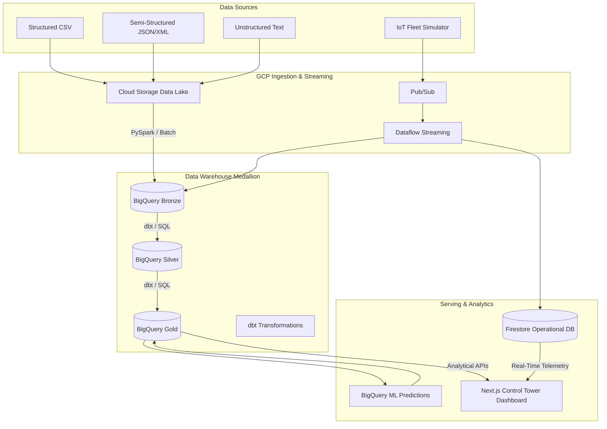

# 🌐 Enterprise Supply Chain & Logistics Data Platform
**Real-Time Fleet Analytics on Google Cloud Platform**

[](https://github.com/iamdpsingh/Project-5-Enterprise-Supply-Chain-Logistics-Data-Platform-with-Real-Time-Fleet-Analytics-on-GCP/actions/workflows/ci_cd.yml)
[](#data-scale)
[](#infrastructure-as-code)
[](#custom-supply-chain-control-tower-dashboard)

An end-to-end enterprise data engineering platform designed for a global logistics company. It ingests, processes, and serves structured, semi-structured, and unstructured data through **batch** and **real-time streaming** pipelines. 

The platform culminates in a custom **Next.js Supply Chain Control Tower**, providing executive-level KPIs, predictive analytics (BigQuery ML), and real-time fleet telemetry visualization.

---

## 🏗️ Architecture Overview



> 📖 **Deep Dive:** For the comprehensive architecture breakdown, see [architecture/04_architecture_design.md](architecture/04_architecture_design.md).

---

## 💻 Custom Supply Chain Control Tower (Dashboard)

Replaced traditional BI tools (like Looker/Streamlit) with a highly scalable, premium **Next.js Full-Stack Web Application**. The Control Tower explicitly justifies the enterprise scale of this project with:

* **Executive Overview Tab:** High-level KPIs (Revenue, Total Shipments, On-Time Delivery rates).
* **Logistics & Supply Tab:** Supplier ratings, warehouse capacity, and data tables for *Shipments at Risk of Delay*.
* **Real-Time Fleet Tab:** Visualizes IoT telemetry with Doughnut charts and a simulated US-map scatter plot of active vehicles (color-coded for speeding anomalies).
* **GCP Integrations:** Real-time polling to Firestore and live BigQuery metadata parsing (displaying query latency and GBs processed dynamically).

**Run the Dashboard locally:**
```bash
cd dashboard
npm install
npm run dev
```

---

## 🛠️ Technology Stack

| Domain | Technology | Purpose |
|---|---|---|
| **Data Lake** | Cloud Storage | Raw / Processed / Rejected zones |
| **Batch Processing** | PySpark | Large-scale joins, dedup, aggregations |
| **Stream Processing** | Pub/Sub + Dataflow | Real-time IoT event processing |
| **Data Warehouse** | BigQuery | Medallion architecture (Bronze → Silver → Gold) |
| **Transformation** | dbt | SQL-based Silver → Gold with testing |
| **Orchestration** | Airflow | Daily batch pipeline scheduling |
| **Operational DB** | Firestore | Low-latency fleet state lookups |
| **ML** | BigQuery ML | Shipment delay prediction (Logistic Regression) |
| **Web Dashboard** | **Next.js + Chart.js** | Enterprise Supply Chain Control Tower |
| **IaC** | Terraform | Reproducible GCP infrastructure |
| **CI/CD** | GitHub Actions | Lint → Test → Build → Deploy |
| **Containers** | Docker | Fleet Simulator deployment |

> 📖 **Deep Dive:** For the rationale behind each choice, see [docs/05_technology_decisions.md](docs/05_technology_decisions.md).

---

## 📚 Project Documentation

| Document | Description |
|---|---|
| [Business Scenario](docs/01_business_scenario.md) | Problem statement, objectives, and business domains |
| [Requirements](docs/02_requirements.md) | Functional and non-functional requirements |
| [KPIs](docs/03_kpis.md) | Key performance indicators tracked by the platform |
| [Architecture Design](architecture/04_architecture_design.md) | Full architecture diagram and layer descriptions |
| [Technology Decisions](docs/05_technology_decisions.md) | Rationale for every technology choice |

---

## 📊 Data Scale

*Synthetic data generation creates a robust environment for performance testing.*

| Dataset | Volume |
|---|---|
| Orders / Items | 1,250,000 |
| Shipments | 500,000 |
| IoT Telemetry Events | 1,000,000 |
| Dimensional Data (Cust/Prod/Veh) | 62,000 |
| **Total** | **~2.8M records** |

---

## 🚀 Getting Started

### Prerequisites
- Python 3.11+
- Node.js 18+ (For Next.js Dashboard)
- Google Cloud SDK (`gcloud`) authenticated
- Java 17 (for PySpark)

### Setup & Execute Pipelines

```bash
# 1. Clone & Setup Python Env
git clone https://github.com/iamdpsingh/Project-5-Enterprise-Supply-Chain-Logistics-Data-Platform-with-Real-Time-Fleet-Analytics-on-GCP.git
cd Project-5-Enterprise-Supply-Chain-Logistics-Data-Platform-with-Real-Time-Fleet-Analytics-on-GCP
python -m venv .venv && source .venv/bin/activate
pip install -r requirements.txt

# 2. Generate synthetic data (~2.8M records)
python data/data_generation.py

# 3. Upload to GCS Data Lake & Load into BigQuery (Bronze)
python ingestion/batch/upload_to_gcs.py
python ingestion/batch/load_to_bigquery.py

# 4. Build Silver, Gold, and SCD Type 2 layers
python sql/run_layers.py

# 5. Run data quality checks & tests
python quality/quality_checks.py
pytest tests/ -v
```

---

## 🌟 Key Engineering Capabilities
- **Medallion Architecture:** Bronze (raw) → Silver (clean/partitioned) → Gold (star schema).
- **Dimensional Modeling:** 7 dimension tables + 3 fact tables with SCD Type 2 history tracking.
- **Data Quality:** Automated validation (nulls, ranges, duplicates) with quarantine routing.
- **Infrastructure as Code (IaC):** Complete GCP resource provisioning via Terraform.
- **CI/CD:** Automated linting (Flake8), testing (Pytest), and dashboard build validation via GitHub Actions.

---
*This project is built as an enterprise-grade portfolio piece demonstrating modern data engineering paradigms.*
