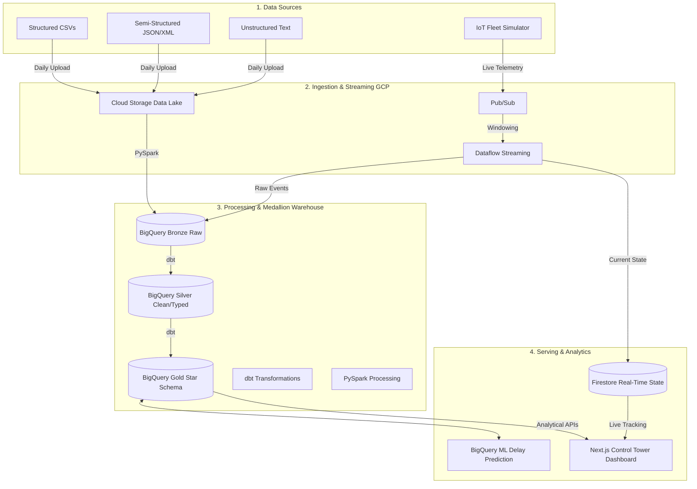

<div align="center">
  
# 🌐 Enterprise Supply Chain & Logistics Data Platform
**End-to-End Batch & Streaming Data Engineering on Google Cloud Platform**

[](https://cloud.google.com)
[](https://cloud.google.com/bigquery)
[](#-data-scale--generation)
[](#-infrastructure-as-code)
[](#-custom-supply-chain-control-tower)

*A comprehensive data engineering portfolio project designed to solve real-world logistics challenges at an enterprise scale.*

</div>

---

## 📖 Project Overview & Business Problem

Global supply chain companies face immense challenges in tracking inventory, optimizing delivery routes, and maintaining vehicle fleets. When data is siloed across CRM systems, warehouse databases, and IoT devices on trucks, it becomes impossible to make real-time decisions.

**The Goal:** Build a centralized, highly scalable data platform on GCP that unifies historical batch data (orders, shipments, inventory) with real-time streaming data (IoT fleet telemetry) to power a live **Supply Chain Control Tower** and predict shipment delays before they happen.

### Key Business Outcomes
* 📉 **Predictive Logistics:** Identify shipments at risk of delay using BigQuery ML.
* 🚚 **Real-Time Fleet Tracking:** Monitor speeding, fuel levels, and engine health across 2,000+ vehicles instantly.
* 📦 **Warehouse Optimization:** Track capacity and supplier performance through automated daily pipelines.

---

## 🏗️ Architecture & Data Pipeline

The pipeline implements the **Medallion Architecture** (Bronze ➔ Silver ➔ Gold) combining both Batch and Streaming paradigms.



### Pipeline Stages
1. **Data Lake (GCS):** Raw files are dumped into landing zones. PySpark handles large-scale deduplication and loads them into BigQuery.
2. **Streaming (Pub/Sub + Dataflow):** Python-based Docker containers simulate 2,000 trucks sending IoT telemetry every second. Dataflow windows the data, sending raw logs to BigQuery and updating current vehicle states in Firestore for low-latency lookups.
3. **Data Warehouse (BigQuery + dbt):** The raw data (Bronze) is cast, cleaned, and partitioned into Silver. It is then modeled into a Kimball Star Schema (Gold) with Slowly Changing Dimensions (SCD Type 2) to track historical changes (e.g., driver license updates).

---

## 🛠️ Technology Stack

| Domain | Technology | Purpose |
|---|---|---|
| **Data Lake** | Google Cloud Storage | Highly durable raw file storage |
| **Batch Processing** | Apache Spark (PySpark) | Distributed processing of massive datasets |
| **Stream Processing** | Pub/Sub + Dataflow | Serverless, real-time IoT event ingestion |
| **Data Warehouse** | Google BigQuery | Scalable analytical database (Medallion architecture) |
| **Transformation** | dbt (Data Build Tool) | Modular, tested, SQL-based transformations |
| **Orchestration** | Apache Airflow | Directed Acyclic Graphs (DAGs) for pipeline scheduling |
| **Operational DB** | Firestore (NoSQL) | Low-latency state storage for the live dashboard |
| **Machine Learning** | BigQuery ML | In-warehouse Logistic Regression for delay prediction |
| **Dashboard UI** | Next.js + React Chart.js | Custom full-stack web application for data consumption |
| **Infrastructure** | Terraform | Infrastructure as Code (IaC) for GCP resource parity |
| **CI/CD** | GitHub Actions | Automated linting (Flake8), testing (Pytest), and builds |

---

## 💻 Custom Supply Chain Control Tower

To prove the platform's value, the data is served via a custom-built, enterprise-grade **Next.js Web Application** rather than a standard BI tool. It features a Google Material Design aesthetic.


*(Note: Replace the placeholder above with a screenshot of your running dashboard!)*

**Key Dashboard Features:**
* **Executive Overview Tab:** High-level KPIs, logistics revenue, and On-Time Delivery rates.
* **Logistics & Supply Tab:** Operational tables highlighting *Shipments at Risk of Delay*.
* **Real-Time Fleet Tab:** A simulated US-map plotting live IoT vehicle coordinates, color-coded for speeding anomalies.
* **GCP Integrations:** The dashboard explicitly polls BigQuery (displaying query latency/bytes processed) and streams from Firestore.

---

## 📊 Data Scale & Generation

A robust, custom synthetic data generator was built using Python's `Faker` and `pandas` to simulate a realistic, messy enterprise environment.

| Dataset | Format | Volume |
|---|---|---|
| Orders / Order Items | CSV | 1,250,000 rows |
| Shipments | CSV | 500,000 rows |
| IoT Telemetry Events | JSON | 1,000,000 rows |
| Dimensional Data (Cust/Prod/Veh) | CSV | 62,000 rows |
| **Total** | | **~2.8M records** |

---

## 🚀 Getting Started

### 1. Prerequisites
- Python 3.11+
- Node.js 18+ (For Next.js Dashboard)
- Google Cloud SDK (`gcloud`) authenticated
- Terraform installed
- Java 17 (for PySpark)

### 2. Infrastructure Setup (Terraform)
```bash
cd terraform
terraform init
terraform apply -var="project_id=YOUR_PROJECT_ID"
```

### 3. Pipeline Execution
```bash
# Clone & Setup Python Env
git clone https://github.com/iamdpsingh/Project-5-Enterprise-Supply-Chain-Logistics-Data-Platform-with-Real-Time-Fleet-Analytics-on-GCP.git
cd Project-5-Enterprise-Supply-Chain-Logistics-Data-Platform-with-Real-Time-Fleet-Analytics-on-GCP
python -m venv .venv && source .venv/bin/activate
pip install -r requirements.txt

# Generate synthetic data
python data/data_generation.py

# Ingest and Process
python ingestion/batch/upload_to_gcs.py
python ingestion/batch/load_to_bigquery.py
python sql/run_layers.py

# Run Data Quality Checks
python quality/quality_checks.py
```

### 4. Run the Control Tower Dashboard
```bash
cd dashboard
npm install
npm run dev
```
Navigate to `http://localhost:3000` to view the live dashboard.

---

## 📂 Deep Dive Documentation
For deeper technical insights into the platform's design, refer to the documentation directory:

1. [Business Scenario & Objectives](docs/01_business_scenario.md)
2. [Detailed Requirements](docs/02_requirements.md)
3. [Key Performance Indicators (KPIs)](docs/03_kpis.md)
4. [Architecture Design & Layer Definitions](architecture/04_architecture_design.md)
5. [Technology Decisions & Rationale](docs/05_technology_decisions.md)

---
<div align="center">
<i>This project is built as an enterprise-grade portfolio piece demonstrating modern data engineering paradigms.</i>
</div>
